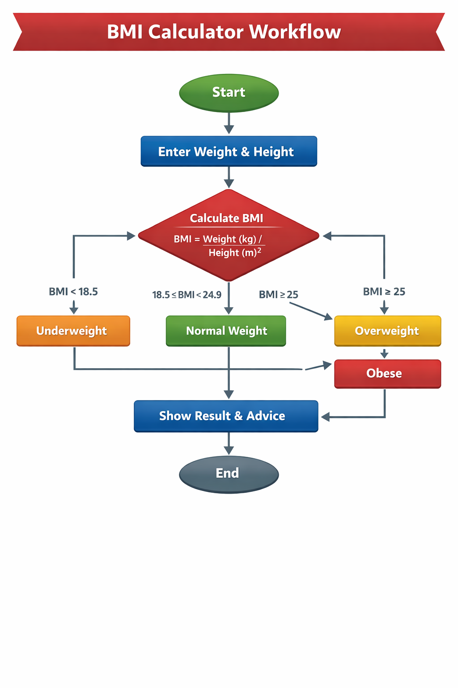
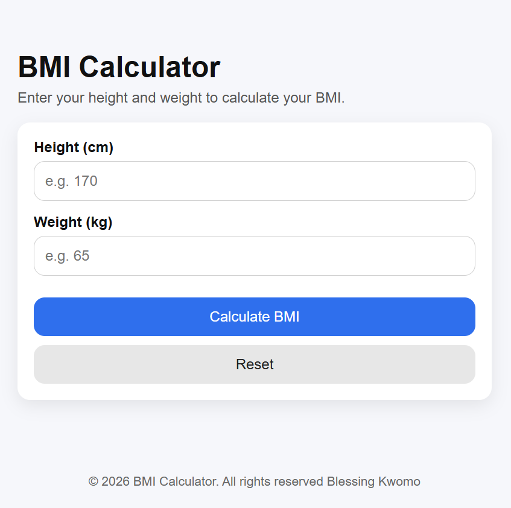
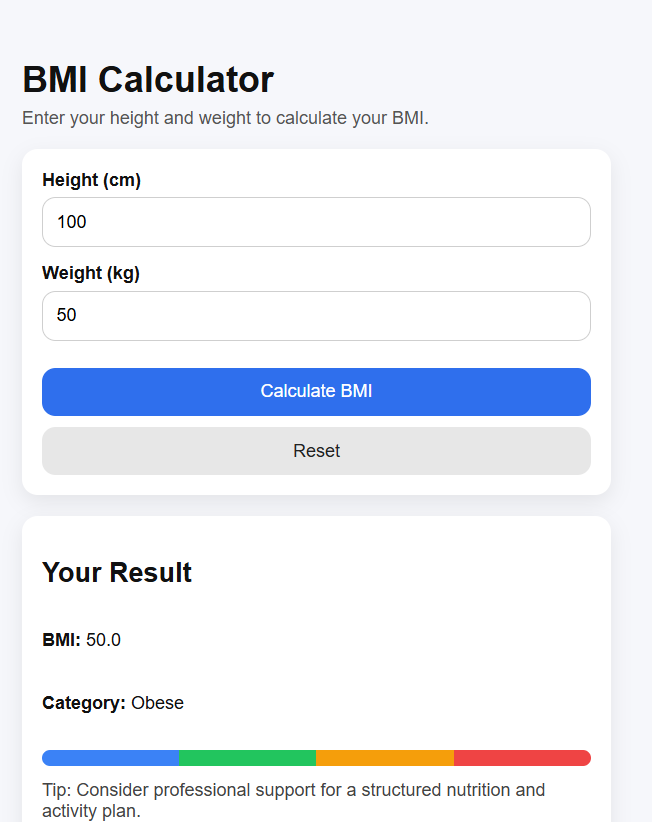
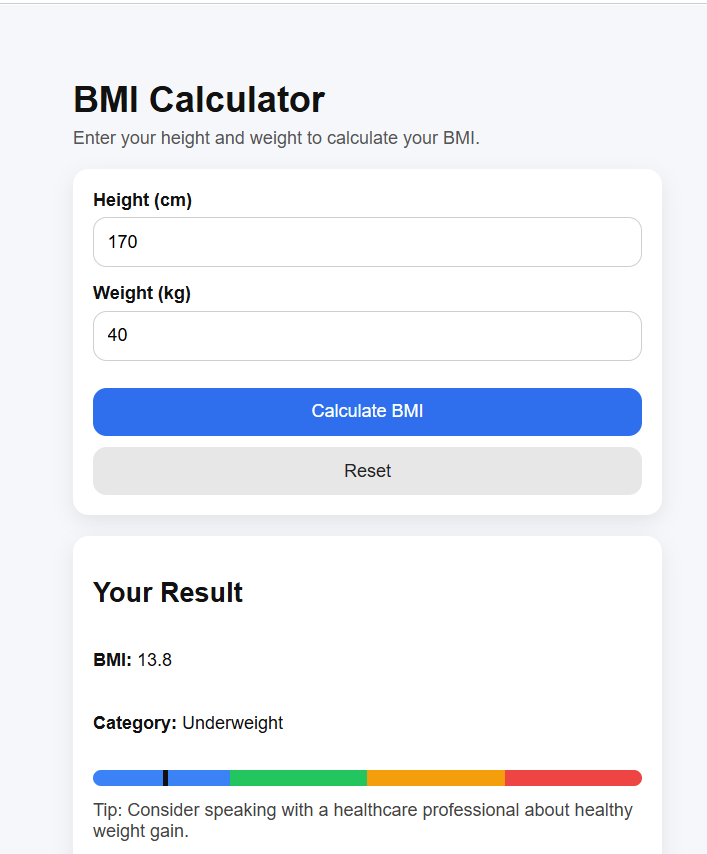
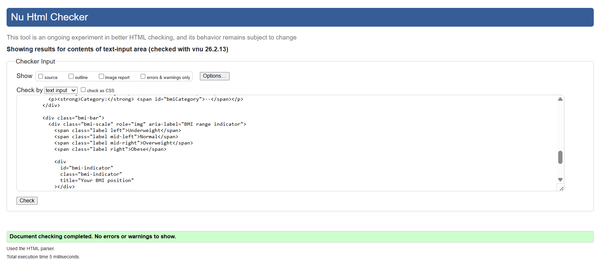
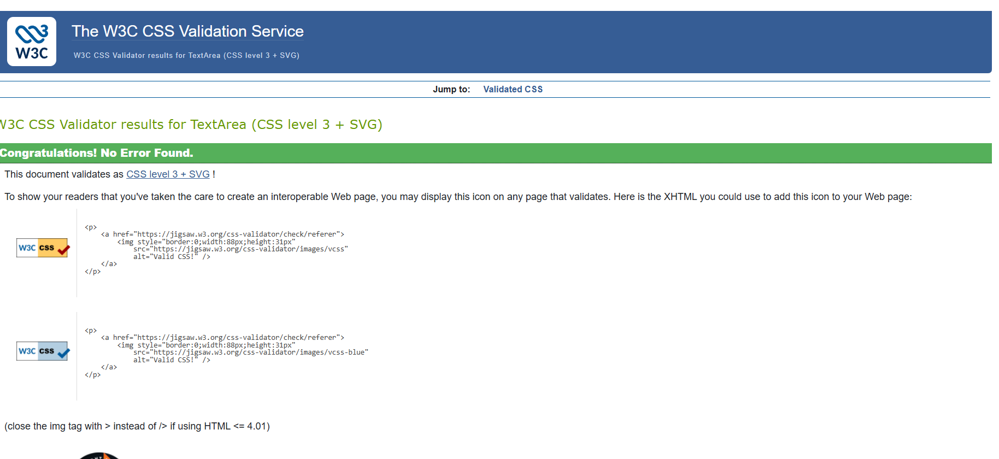
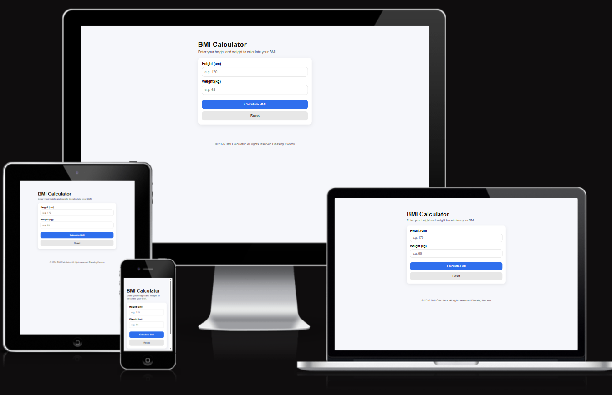

<h2>BMI Calculator 🧮📏</h2>

<h3>Workflow 🚀</h3>

Here is a visual representation of the workflow chart:

<h3>Table of Contents</h3>

<ul>
<li>Description</li>

<li>About This Project</li>

<li>How It Works</li>

<li>Input Height & Weight</li>

<li>BMI Calculation</li>

<li>Result & Indicator Bar</li>

<li>Live Demo</li>

<li>Features</li>

<li>Getting Started</li>

<li>Manual Testing</li>

<li>Acknowledgements</li>

<li>Footer</li>
</ul>

<h3>Description</h3>

Calculate your Body Mass Index easily and visually. 🎯

The BMI Calculator is a simple, responsive web application that allows users to enter their height and weight to instantly calculate their Body Mass Index (BMI). The app displays the BMI value, health category, and a visual color indicator bar to help users understand where they fall within standard BMI ranges.

This project was built as part of my Full Stack Web Development portfolio to demonstrate clean HTML structure, modern CSS styling, JavaScript logic, form validation, and basic accessibility practices.

<h3>About This Project</h3>

<h3>This project focuses on:</h3>
<ul>
<li>Clean UI and UX</li>

<li>Beginner-friendly JavaScript logic</li>

<li>Form validation</li>

<li>Accessibility improvements</li>

<li>W3C validation compliance</li>

<li>Visual feedback using a BMI indicator bar</li>
</ul>

The goal is to build practical, real-world mini applications that demonstrate strong foundational web development skills.

<h3>How It Works </h3>

<ul>
<li>Input Height & Weight 📏⚖️</li>
<h4> Users enter:</h4>

<li>Height in centimeters (cm)</li>

<li>Weight in kilograms (kg)</li>

<li>The app validates input to ensure realistic values before calculation.</li>
</ul>

<h3>BMI Calculation 🧠</h3>
<ul>
<li>The BMI formula used:</li>

<li>BMI = weight (kg) / (height (m) × height (m))</li>
</ul>

<h3>JavaScript handles:</h3>

<ul>
<li>Unit conversion (cm → m)</li>

<li>Calculation</li>

<li>Rounding to 1 decimal place</li>
</ul>
<h3>Result & Indicator Bar 🎨</h3>

  

<h3>The app displays:</h3>
<ul>
<li>BMI value</li>

<li>BMI category (Underweight, Normal, Overweight, Obese)</li>

<li>A color indicator bar that visually represents where the BMI falls on the scale</li>
</ul>

<h3>Live Demo</h3>

  <strong>Live Demo:</strong> 
  👉 <a href="https://princessble.github.io/bmi-calculator/" target="_blank">
    https://princessble.github.io/bmi-calculator/
  </a>

<h3>Features 🚀</h3>
<ul>

<li>BMI calculation using JavaScript</li>

<li>Real-time visual BMI indicator bar</li>

<li>Input validation with user-friendly errors</li>

<li>Responsive design (mobile-friendly)</li>

<li>Reset functionality</li>

<li>W3C HTML & CSS validation compliance</li>

<li>Accessible labels and ARIA support</li>

<h3>Getting Started</h3>

To run this project locally:

<ul>
<li>Clone the repository</li>

<li>Navigate into the project folder</li>

<li>Open index.html in your browser</li>
</ul>

<pre><code>git clone https://github.com/princessble/bmi-calculator.git
cd bmi-calculator</code></pre>

<h3>Manual Testing</h3>

Before deploying this project, I performed the following manual tests:

<ul>
<li>Navigation / UI</li>

<li>Page loads correctly</li>

<li>Buttons are clickable</li>
</ul>

<h3>Forms</h3>
<ul>
<li>Height input validation</li>
 
<li>Weight input validation</li>

<li>Error messages display correctly</li>

<li>Reset button clears fields and result</li>
</ul>

Responsiveness

 Desktop layout

 Tablet layout

 Mobile layout

Browser Compatibility

 Chrome

 Firefox

 Microsoft Edge

Accessibility

 Labels linked to inputs

 Screen reader-friendly result section

 Keyboard navigation

Validation and Responsiveness

HTML Validation:

W3C HTML Validator

CSS Validation:

W3C CSS Validator

Responsive Design Checker:

Responsive Design Checker

Acknowledgements 🙏

Special thanks to my mentors and learning communities for guidance and encouragement throughout my web development journey.

Gratitude to:

Open-source community – for tools, documentation, and inspiration

Tools & Technologies Used

HTML & CSS 🌐🎨

JavaScript ⚙️

Git & GitHub 🐙

VS Code 💻

Browser DevTools 🔍

Footer

© 2026 BMI Calculator · Built by Blessing Kwomo. All rights reserved. 🌟

For more projects, visit my GitHub:
👉 https://github.com/princessble

 